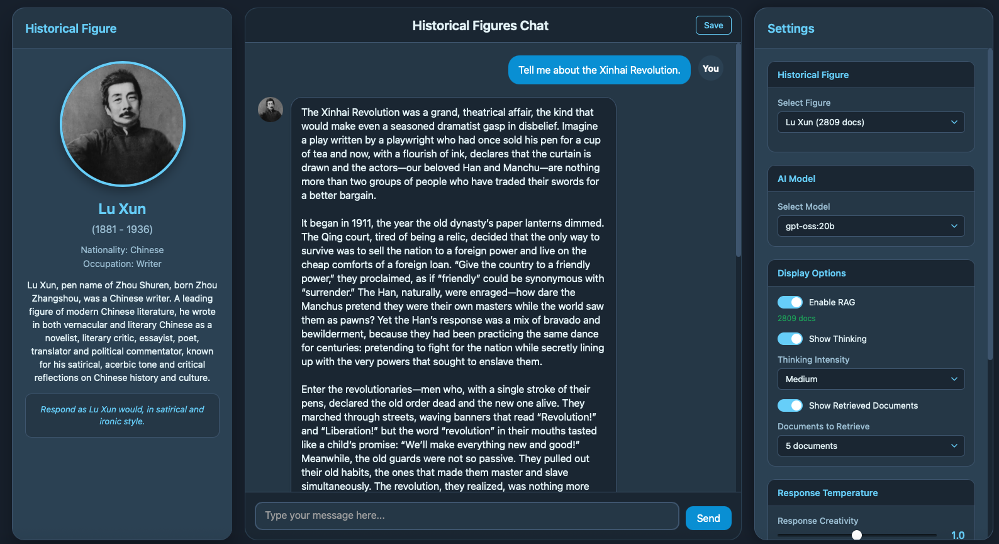

# Historical Figures Chat System

Chat with historical figures using RAG-enhanced AI. Upload documents and have conversations in their authentic style.



## Hardware Acceleration

Supports CUDA (NVIDIA GPUs), MPS (Apple Silicon), and CPU. Hardware is detected automatically.

## Quick Start

```bash
git clone https://github.com/mcjkurz/histfig.git
cd histfig

python3 -m venv venv
source venv/bin/activate
pip install -r requirements.txt
```

### Environment Variables

```bash
export LLM_API_URL="https://api.poe.com/v1"  # Any OpenAI-compatible endpoint
export LLM_API_KEY="your-api-key"               # Required for most APIs
export DEFAULT_MODEL="your-model-name"
export ADMIN_PASSWORD="your-admin-password"

# Model source selection (External API is default in UI)
export EXTERNAL_MODELS="GPT-5-mini,GPT-5-nano,Gemini-2.5-Flash"  # Models for external API
export LOCAL_MODELS="gpt-oss:20b,llama2,mistral"           # Models for local source
```

**Model Source Notes:**
- Leave `EXTERNAL_MODELS` empty to fetch available models from the external API
- Leave `LOCAL_MODELS` empty to fetch available models from local LLM API
- UI defaults to External API source

### Run

```bash
./start.sh
```

Access at:
- Chat: `http://localhost:5001/`
- Admin: `http://localhost:5001/admin/`

## Scripts

| Script | Purpose |
|--------|---------|
| `./start.sh` | Start server in background |
| `./utils/check_status.sh` | Check server status |
| `./utils/kill_ports.sh` | Stop server |
| `./utils/clean_logs.sh` | Remove log files |
| `./utils/rebuild_bm25.sh` | Rebuild search indexes |

## Configuration

All settings in `config.py`: port, models, upload limits, chunking, etc.
